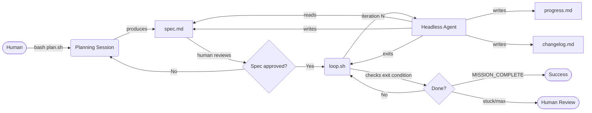
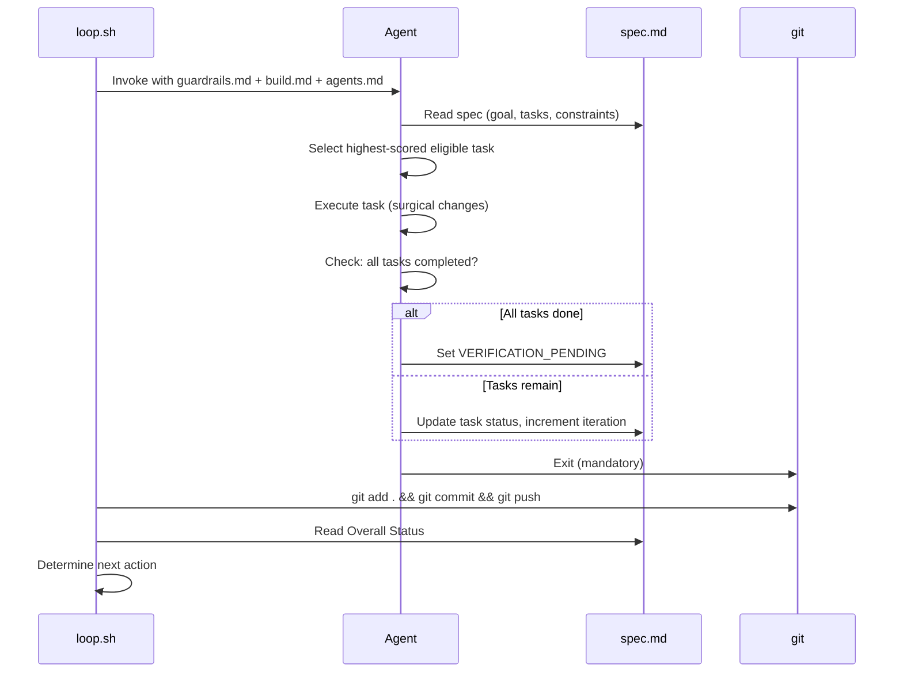
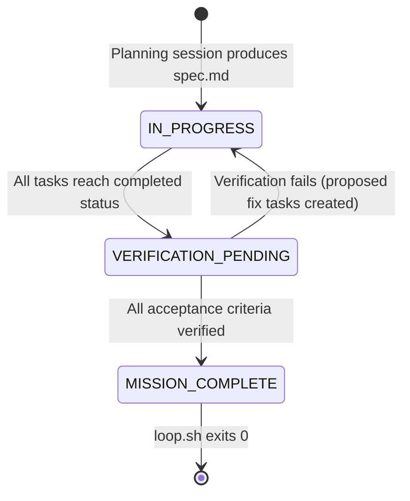
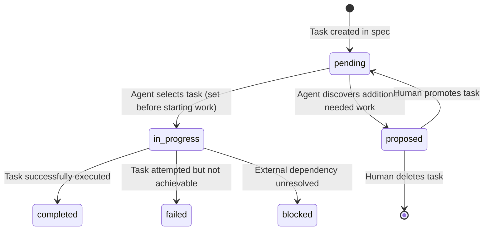
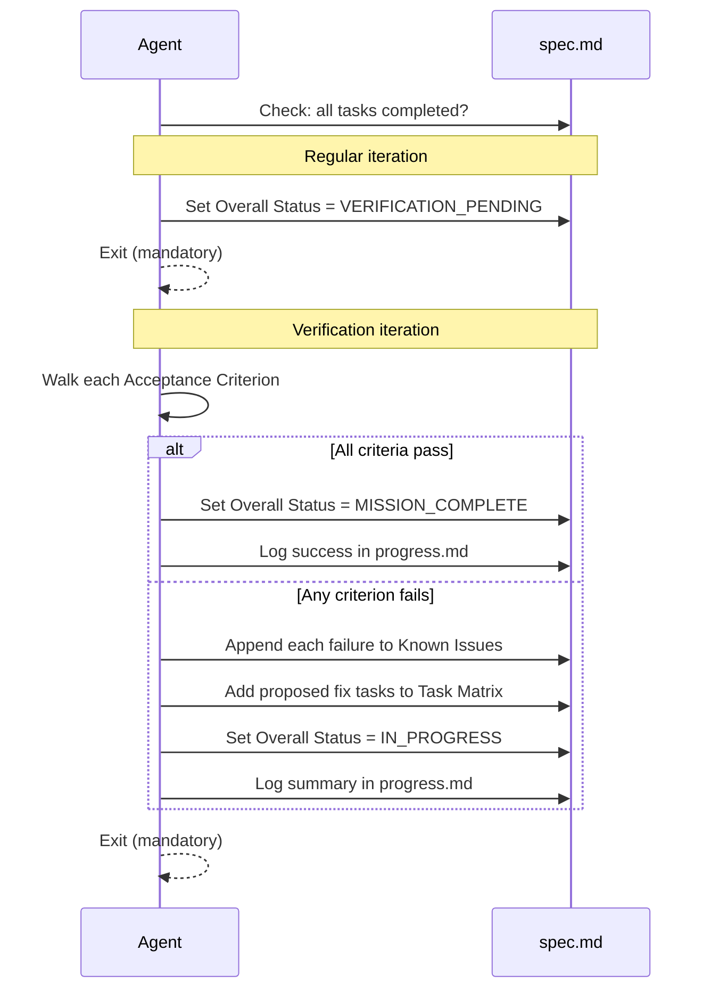

# Ralph-Loop Product Specification

## 1. Product Overview

Ralph-Loop is a headless, iterative AI agent orchestration framework. It provides a structured protocol for decomposing a software project into a scored task matrix and executing it autonomously across multiple agent sessions, each starting with a fresh context window.

**Core design principle**: the spec file is the only persistent state. The agent has no memory of prior sessions. Every action is driven by reading `spec.md`, and every outcome is recorded back to it. This makes the system resilient to individual iteration failures and fully resumable.

**Target audience**: Software engineers who want to delegate structured, multi-step development work to an AI agent without supervision, while retaining full auditability and rollback capability through git.

**Value proposition**:
- Deterministic task selection via scoring eliminates ambiguity about what to work on next
- One-task-per-turn discipline creates atomic, reviewable git commits
- Fresh context each iteration prevents context window saturation on long projects
- Two-phase verification separates task completion from mission completion, preventing silent failures

---

## 2. Architecture

### Two-Phase Model



### Single Iteration Lifecycle



### Component Inventory

| File | Phase | Role | Modified by Agent? |
|:---|:---|:---|:---|
| `spec.md` | Both | Single source of truth -- project plan + live state | Yes (every iteration) |
| `agents.md` | Execution | Operational guide: build/test/lint commands; agents append learnings at runtime | Append only |
| `prompts/build.md` | Execution | Standing headless agent instructions, read every execution iteration | No |
| `prompts/plan.md` | Planning | Ten-stage Q&A instructions for the planning agent (4 product discovery + 6 execution planning) | No |
| `prompts/plan-work.md` | Planning | Feature-branch scoped planning instructions | No |
| `prompts/guardrails.md` | Both | Shared rules injected into every prompt by loop.sh | No |
| `stream/parser.sh` | Execution | Token counting stream middleware; exit 10 = clean rotate | No |
| `stream/gutter.sh` | Execution | Stuck-loop pattern detector; exit 1 = gutter detected | No |
| `plan.sh` | Planning | Bash launcher for interactive planning session | No |
| `plan.ps1` | Planning | PowerShell launcher for interactive planning session | No |
| `loop.sh` | Execution | Bash orchestrator -- invokes agent, commits, checks exit | No |
| `loop.ps1` | Execution | PowerShell orchestrator | No |
| `progress.md` | Execution | Append-only human audit trail -- never read by agents | Append only |
| `changelog.md` | Execution | Append-only educational log of introduced items -- never read by agents | Append only |
| `specs/` | Both | Per-topic spec files for complex projects (optional) | Yes (agent reads; agent may write) |
| `logs/` | Execution | Per-iteration agent output logs (auto-created) | Created by loop.sh |

---

## 3. State Machine

### Overall Status



### Task Status Transitions



### Exit Codes

| Code | Condition | Meaning |
|:---|:---|:---|
| `0` | `MISSION_COMPLETE` in spec | All acceptance criteria verified and met |
| `1` | Max iterations reached | Safety cap hit -- review logs and raise the limit or fix the spec |
| `2` | No `pending` tasks, no `proposed` tasks | Stuck -- all remaining tasks are `blocked` or `failed`; human intervention required |
| `3` | No `pending` tasks, `proposed` tasks exist | Agent discovered new tasks; promote `proposed` to `pending` and re-run |
| `4` | Gutter detected | Agent in a stuck loop; review `progress.md` for repeated patterns |
| `130` | Ctrl+C / SIGTERM | Manual interruption; safe to re-run |

---

## 4. Scoring and Task Selection

### Scoring Formula

```
Score = (Impact x 3) + (Blocking x 2) + (Risk x 1)
```

| Component | Range | Definition |
|:---|:---|:---|
| Impact | 1-5 | How directly does this task satisfy an acceptance criterion? Higher = more direct. |
| Blocking | 0-N | How many other pending tasks list this task as a dependency? Computed from the task matrix during planning. |
| Risk | 1-3 | How uncertain or complex is the implementation? Higher risk = done earlier to surface problems sooner. |

### Selection Rules

1. Filter to all tasks with status `pending` and all dependencies in `completed` state.
2. Ignore all `proposed` tasks -- these are not selectable.
3. Select the task with the highest `Score`.
4. **Tiebreak 1**: If scores are equal, select the lowest-numbered task ID (T1 before T2, T1.1 before T1.2).
5. **Tiebreak 2**: If a parent task and a standalone task share the highest score, the lowest task ID wins first; then the sub-task rule applies within that parent.

### Immutability Constraint

Scores are set during the planning session and **never modified by headless agents**. Changing scores between runs is a human-only operation, done by editing `spec.md` directly before re-launching `loop.sh`.

---

## 5. Supported Engines

### Engine Comparison

| Engine | Invocation | Streaming | Requires | Notes |
|:---|:---|:---|:---|:---|
| `gemini` | `gemini -p "$PROMPT" -y` | Yes (stdbuf) | `gemini` CLI, nvm | Default engine |
| `claude` | `claude -p "$PROMPT" --dangerously-skip-permissions` | Yes (jq + stream-json) | `claude` CLI, optionally `jq` | Real-time output requires jq; falls back to buffered without it |
| `copilot` | `copilot -p "$PROMPT" --allow-all-tools` | Yes (stdbuf) | `copilot` CLI | Does not support semantic commit parsing in loop.ps1 |

### Model Override

All scripts accept an optional `model` argument to override the engine's default model:

```bash
# Bash
bash .ralph/loop.sh claude 20 true claude-opus-4-6

# PowerShell
.\.ralph\loop.ps1 -Engine claude -Model claude-opus-4-6
```

### Environment Requirements

| Requirement | Purpose |
|:---|:---|
| `$HOME/.local/bin` on PATH | Resolves user-local CLI binaries (claude, gemini, copilot) |
| nvm sourced | Resolves nvm-managed binaries (gemini is typically nvm-managed) |
| `jq` (optional) | Enables real-time streaming output for the claude engine |
| `CLAUDE_CODE_MAX_OUTPUT_TOKENS=64000` | Raises per-response token ceiling (set automatically by loop.sh) |

---

## 6. Verification Protocol

### Why Two-Phase Completion

Marking all tasks `completed` does not guarantee the project works. Tests may still fail, acceptance criteria may be partially met, or constraint violations may have been introduced. The verification phase enforces an explicit evidence-based check before the loop terminates.

### Verification Sequence



### Verification Failure Recovery

When verification fails, the loop exits with code `3` (proposed tasks exist). The human reviews the proposed fix tasks in `spec.md`, promotes approved tasks to `pending`, then re-runs `loop.sh`. The loop re-enters `IN_PROGRESS`, executes the fix tasks, and triggers another verification pass.

---

## 7. Safety and Recovery

### One-Task-Per-Turn Enforcement

The headless agent protocol (`prompts/build.md`) mandates that the agent exits after completing exactly one task. This is enforced by the `## MANDATORY EXIT` step in the agent's execution protocol. `loop.sh` re-invokes the agent from scratch for each iteration, making it structurally impossible for a single agent session to execute multiple tasks -- even if the agent ignored the instruction, `loop.sh` would terminate the process before it could begin another task.

### Fresh Context Per Iteration

Each agent invocation is a completely independent process. The agent has no access to previous session outputs, memory stores, or conversation history. All state flows exclusively through `spec.md`. This means:
- Context window saturation is impossible regardless of project length
- A failed or confused iteration cannot pollute subsequent ones
- The agent cannot make incorrect assumptions based on stale in-memory state

### Append-Only Logs

`progress.md`, `changelog.md`, and the `## Known Issues` section of `spec.md` are append-only. Agents are instructed never to edit existing entries. This guarantees an immutable audit trail that is always recoverable even if a later iteration corrupts `spec.md`.

### Git Rollback Granularity

Every iteration produces exactly one git commit (per task). If an iteration produces incorrect output, `git revert` or `git reset` on that single commit removes exactly the problematic changes. The loop can then be resumed from the prior spec state.

### Planning Session Overwrite Guard

`plan.sh` and `plan.ps1` check whether `spec.md` already exists before launching the planning session. If it does, the user is prompted for confirmation before the file is overwritten. This prevents accidentally destroying a live or completed spec.

---

## 8. Configuration Reference

### CLI Arguments -- loop.sh / loop.ps1

| Argument | Bash Position | PowerShell Flag | Values | Default |
|:---|:---|:---|:---|:---|
| engine | `$1` | `-Engine` | `gemini`, `claude`, `copilot` | `gemini` |
| max_iterations | `$2` | `-MaxIterations` | any integer | `20` |
| push | `$3` | `-Push` | `true`, `false` | `true` |
| model | `$4` | `-Model` | model ID string | engine default |
| mode | `$5` | `-Mode` | `build`, `plan-work` | `build` |
| work_scope | `$6` | `-WorkScope` | description string | `""` |
| -- | `--dry-run` flag | `-DryRun` switch | -- | off |

### CLI Arguments -- plan.sh / plan.ps1

| Argument | Bash Position | PowerShell Flag | Values | Default |
|:---|:---|:---|:---|:---|
| engine | `$1` | `-Engine` | `gemini`, `claude`, `copilot` | `gemini` |
| model | `$2` | `-Model` | model ID string | engine default |
| mode | `$3` | `-Mode` | `plan`, `plan-work` | `plan` |
| work_scope | `$4` | `-WorkScope` | description string | `""` |

### Environment Variables

| Variable | Set By | Effect |
|:---|:---|:---|
| `CLAUDE_CODE_MAX_OUTPUT_TOKENS` | `loop.sh` (auto) | Raises per-response output ceiling to 64,000 tokens for large file writes |
| `PATH` | `loop.sh` (auto) | Prepends `~/.local/bin`, `~/.npm-global/bin`, `/usr/local/bin` |
| `RALPH_TOKEN_WARN` | User (optional) | Token count for warn threshold (default: 100000); triggers `[TOKEN WARNING]` to stderr |
| `RALPH_TOKEN_ROTATE` | User (optional) | Token count for rotate threshold (default: 128000); parser exits 10, loop treats as clean end |
| `RALPH_GUTTER_LOOKBACK` | User (optional) | Number of recent progress entries to examine for stuck-loop patterns (default: 6) |
| `WORK_SCOPE` | `loop.sh` / `plan.sh` (auto) | Injected into `plan-work.md` via envsubst substitution |
| `RALPH_AGENT_TIMEOUT` | User (optional) | Per-agent wall-clock timeout in seconds (default: 1800 = 30m); requires `timeout(1)` on Linux/macOS. Agents exceeding this limit are killed and their task marked failed. Set to a shorter value (e.g. `10`) to test timeout behavior. |
| `RALPH_SPAWN_DELAY` | User (optional) | Delay in seconds between parallel agent launches (default: 2); reduces API burst when dispatching multiple agents simultaneously. Set to `0` to disable. |
| `RALPH_BACKOFF_MAX` | User (optional) | Maximum exponential backoff sleep in seconds (default: 300 = 5m); caps the delay applied when consecutive batches all fail. Must be a positive integer. |
| `RALPH_CIRCUIT_BREAKER` | User (optional) | Number of consecutive all-fail batches before escalated delay kicks in (default: 3); multiplies the backoff by the failure count once threshold is reached. Must be a positive integer. |
| `RALPH_MAX_LOG_SIZE` | User (optional) | Maximum per-iteration log file size in bytes (default: 52428800 = 50MB); when exceeded, the oldest half of the log is truncated. Checked once per iteration at the token warn threshold. |

### File Paths (relative to project root)

| Path | Description |
|:---|:---|
| `.ralph/spec.md` | Project specification and live state (produced by plan.sh) |
| `.ralph/agents.md` | Operational guide: build/test/lint commands (produced by plan.sh, agents append) |
| `.ralph/prompts/build.md` | Headless agent standing instructions |
| `.ralph/prompts/plan.md` | Planning agent ten-stage Q&A instructions |
| `.ralph/prompts/plan-work.md` | Feature-branch scoped planning instructions |
| `.ralph/prompts/guardrails.md` | Shared rules injected into every prompt |
| `.ralph/stream/parser.sh` | Token counting stream middleware |
| `.ralph/stream/gutter.sh` | Stuck-loop pattern detector |
| `.ralph/plan.sh` | Interactive planning session (Bash) |
| `.ralph/plan.ps1` | Interactive planning session (PowerShell) |
| `.ralph/loop.sh` | Headless execution orchestrator (Bash) |
| `.ralph/loop.ps1` | Headless execution orchestrator (PowerShell) |
| `.ralph/progress.md` | Append-only iteration audit trail |
| `.ralph/changelog.md` | Append-only educational item log |
| `.ralph/specs/` | Per-topic spec files (optional, for complex projects) |
| `.ralph/logs/iteration_N.log` | Per-iteration full agent output (auto-created) |

---

## 9. Integration Guide

### Setup

Copy all Ralph-Loop template files into a `.ralph/` directory at your project root:

```bash
cp -r /path/to/ralph-loop/. .ralph/
```

The `.ralph/` directory should be committed to the project repo. The `logs/` subdirectory is created at runtime by `loop.sh`.

### Planning Phase

1. Run `bash .ralph/plan.sh [engine]` from the project root.
2. The planning agent conducts a ten-stage Q&A:
   - **Stage 0a**: Product vision & audience -- what are you building, for whom, what problem?
   - **Stage 0b**: Research & validation (optional) -- validate tech choices using available tools
   - **Stage 0c**: Feature scoping -- must-have / should-have / nice-to-have breakdown
   - **Stage 0d**: Technical architecture -- stack, components, integrations
   - **Stage 1**: Goal alignment -- confirm the mission in one sentence (synthesized from discovery)
   - **Stage 2**: Technical constraints -- define what the agent must never do
   - **Stage 3**: Acceptance criteria -- define verifiable "done" conditions
   - **Stage 4**: Task decomposition -- break goal into T1, T1.1, T1.2, T2... structure
   - **Stage 5**: Scoring -- assign Impact, Risk, compute Blocking, calculate Score
   - **Stage 6**: Spec write -- produce final `spec.md` from the template format
   > The entire product discovery tier (stages 0a–0d) can be skipped with one sentence from the user.
3. Review `spec.md` manually after the session. Verify task decomposition, scores, constraints, and acceptance criteria are correct before proceeding.

### Execution Phase

```bash
bash .ralph/loop.sh [engine] [max_iterations] [push]
```

The loop runs until an exit condition is reached. Monitor the terminal output for iteration progress and exit messages.

### Resuming an Interrupted Loop

If `loop.sh` exits prematurely (Ctrl+C, exit code 1, 2, or 3), resume by re-running it. The loop reads **Current Iteration** from `spec.md` to seed the iteration counter, so iteration numbering continues correctly. The branch created on iteration 0 (`ralph/<slug>`) is reused automatically.

### Branch Strategy

On iteration 0, `loop.sh` creates a `ralph/<project-slug>` branch from the current branch. The project slug is derived from the `# Ralph Project Specification: [title]` line in `spec.md`. All subsequent iterations commit to this branch, keeping the main branch clean. To merge after mission complete:

```bash
git checkout main
git merge ralph/<project-slug>
```

### Consuming Dependency Outputs

An agent may optionally read `.ralph/logs/iteration_N.log` for a direct dependency task if the current task needs to consume output that dependency produced. This is the only cross-iteration data flow permitted outside of `spec.md`.

---

## 10. Known Limitations

| Limitation | Nature | Workaround |
|:---|:---|:---|
| No inter-iteration memory | By design -- guarantees fresh context | All state must flow through spec.md |
| Single-repo scope | Each loop instance operates on one repo | Run separate loops for multi-repo projects |
| Scores are immutable during execution | By design -- prevents agent score manipulation | Edit spec.md manually between runs if re-scoring is needed |
| loop.ps1 gutter detection requires bash | Calls stream/gutter.sh via bash | Install Git Bash or WSL on Windows; gutter check is skipped if bash is not on PATH |
| Copilot engine has no streaming output parsing | copilot CLI limitation | Output is buffered; use gemini or claude for real-time visibility |
| jq required for real-time Claude output | External dependency | Install jq or accept buffered output fallback |
| `timeout(1)` required for per-agent timeout | Linux/macOS coreutils | Install coreutils; graceful degradation (warning printed, agents run without timeout) if missing |
| loop.ps1 uses Start-Job polling (200ms interval) | PowerShell job model | Output is near-real-time (200ms latency); use loop.sh for true streaming on Linux/macOS |
| Exponential backoff delays all-fail batches | Intentional backpressure | Reduce `RALPH_BACKOFF_MAX` (minimum: 1) or `RALPH_CIRCUIT_BREAKER` to limit escalation; backoff only activates on complete batch failure |

---

*Authored by: Claude Sonnet 4.6*
